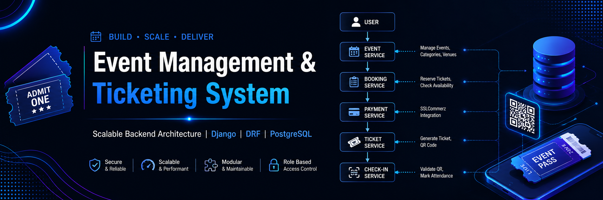

# 🎪 Event Management & Ticketing System

A scalable backend system for managing events, ticket booking, payments, and secure QR-based check-ins.
Built with Django, Django REST Framework, PostgreSQL, JWT, and Docker.

---



---

## 🧠 System Overview

The system follows a real-world backend flow:

User → Event → Booking → Payment → Ticket → Check-in

Each layer is separated to ensure scalability and clean responsibility handling.

---

## 🏗️ High-Level Architecture

```
User
  ↓
Event Service
  ↓
Booking Service
  ↓
Payment Service (SSLCommerz)
  ↓
Ticket Service (QR Generation)
  ↓
Check-in Service
````

---

## 🏛️ Full System Architecture

```
                ┌──────────────┐
                │    User      │
                └──────┬───────┘
                       │
            ┌───────────────────────┐
            │     Django API        │
            └─────────┬─────────────┘
                      │
     ┌────────────────┼────────────────┐
     │                │                │
 Event Service   Booking Service   Auth (JWT)
     │                │
     │                ↓
     │        Payment Service (SSLCommerz)
     │                ↓
     │         Ticket Service (QR)
     │                ↓
     └────────→ Check-in Service
```

---

## 🗄️ Database Design (ERD)

```
User ──< Booking ──< Payment ──< Ticket ──< CheckIn
              │
              └── Event ──< TicketType
```

---

## 🔁 Event Lifecycle (State Machine)

```
Draft → Pending → Approved → Live → Completed
```

---

## 💳 Payment Flow

```
Booking Created
      ↓
SSLCommerz Payment
      ↓
Webhook Callback
      ↓
Payment Verified
      ↓
Ticket Generated
```

---

## 🎫 Ticket Lifecycle

```
TicketType → Ticket Issued → QR Generated → Used at Check-in → Marked Used
```

---

## 🚀 Key Engineering Highlights

* Multi-tenant architecture with role-based access control (RBAC)
* Booking-first design to prevent overselling
* Event state machine for controlled publishing
* Idempotent payment processing using webhook validation
* QR-based ticket issuance and validation system
* Concurrency-safe booking system design
* Modular backend architecture for scalability

---

## 🧠 Why This System Matters

This project simulates a real production-level ticketing platform and demonstrates:

* Strong backend system design thinking
* Handling of distributed state changes
* Payment integration with external services
* Scalability and concurrency handling
* Clean separation of responsibilities

---

## 📌 One-line System Summary

A booking-first event management system with strict separation between reservation, payment, and ticket issuance layers ensuring consistency, scalability, and real-world reliability.

## 🌐 Production Deployment

The system is live and running in production:

🔗 Base URL: https://event-management-ticketing-system-d5ei.onrender.com
